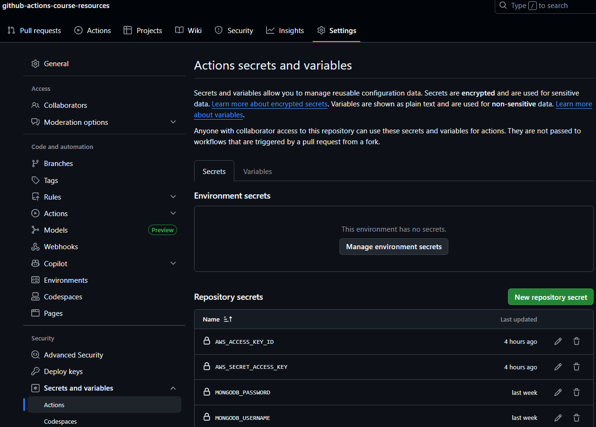

> This material is from [Maximilian Schwarzmüller's udemy course](https://www.udemy.com/course/github-actions-the-complete-guide)

# GitHub Actions Course — Workflows & Documentation Overview

This repository is a complete **GitHub Actions learning project**, containing practical CI/CD workflows and well-structured documentation.
It is designed for developers who want to understand GitHub Actions from basics to advanced concepts.

---

# 🔐 Add Secrets to the github 

we need four secrets to run pipeline correctly, add them into your github action secrets

[how to add secrets to github action](./docs/Secrets.md#️-2-如何建立-repository-secrets)

- MONGODB_USERNAME
- MONGODB_PASSWORD
- AWS_ACCESS_KEY_ID
- AWS_SECRET_ACCESS_KEY




# 🚀 Available Workflows

All workflows are located in:

```
.github/workflows/
```

They cover the entire spectrum of GitHub Actions usage, including:

### **02_Basics**

* Basic workflow structure
* Steps, runners, actions

### **03_Events**

* `push`, `pull_request`, `schedule`, `workflow_dispatch`
* Event-driven automation

### **04_Artifacts_Outputs**

* Uploading/downloading artifacts
* Passing outputs between jobs

### **05_Environment_Variables_Secrets**

* `env` variables
* GitHub Secrets and security practices

### **06_Execution_Flow**

* `needs`, `if`, `continue-on-error`
* Job dependency and conditional logic

### **07_Containers**

* Running workflows inside Docker containers
* Service containers

### **08_Custom_Actions**

* JavaScript actions
* Docker-based actions
* Composite actions

### **09_Security**

* Script injection examples
* Secure coding practices for workflows

You can run each workflow directly through the GitHub Actions UI or by pushing commits to the repository.

---

# 📘 Documentation (docs/)

All GitHub Actions concepts used in this repository are documented in the [docs/](./docs/README.md) folder: