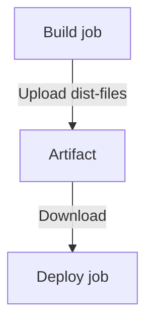

# GitHub Actions Artifacts

Artifacts are one of the core mechanisms in GitHub Actions used to **pass files between jobs, store test results, preserve build outputs, and support debugging workflows**.

This guide explains:

* What Artifacts are
* Why they are needed
* How to upload and download artifacts
* Multi-job pipeline examples (with diagrams)
* Common errors and troubleshooting
* Official documentation links

---

## 📌 What Is an Artifact?

An **artifact** is any file or directory saved after a workflow job finishes.

Common use cases include:

* Passing build outputs between jobs (e.g., `build → deploy`)
* Storing test reports (JUnit, coverage, logs)
* Saving distribution files (e.g., `dist/`, binaries, ZIP archives)
* Uploading logs for debugging

📖 Official docs: [https://docs.github.com/en/actions/using-workflows/storing-workflow-data-as-artifacts](https://docs.github.com/en/actions/using-workflows/storing-workflow-data-as-artifacts)

---

## 📦 Uploading Artifacts — `actions/upload-artifact`

```yaml
- name: Upload artifacts
  uses: actions/upload-artifact@v4
  with:
    name: dist-files
    path: dist
```

### Key Parameters

| Parameter           | Description                              |
| ------------------- | ---------------------------------------- |
| `name`              | The artifact name (required to download) |
| `path`              | Files or directories to upload           |
| `if-no-files-found` | `ignore` / `warn` / `error`              |

---

## 📥 Downloading Artifacts — `actions/download-artifact`

This extracts the artifact into the specified folder:

```yaml
- name: Get build artifacts
  uses: actions/download-artifact@v4
  with:
    name: dist-files
    path: ./dist
```

### Common Errors

❌ **Artifact not found**

Usually caused by:

* Wrong artifact name (must match exactly)
* Build job failed → no artifact was uploaded
* Missing job dependency (`needs: build`)

---

## 🔗 Multi-Job Pipeline Example (Build → Deploy)

```yaml
jobs:
  build:
    runs-on: ubuntu-latest
    steps:
      - uses: actions/checkout@v3
      - run: npm ci
      - run: npm run build
      - name: Upload build
        uses: actions/upload-artifact@v4
        with:
          name: dist-files
          path: dist

  deploy:
    runs-on: ubuntu-latest
    needs: build
    steps:
      - uses: actions/checkout@v3
      - name: Download artifact
        uses: actions/download-artifact@v4
        with:
          name: dist-files
          path: ./dist
      - run: echo "Deploying..."
```

### Pipeline Diagram (Mermaid)



---

## 🧪 Example: Upload Test Report Only on Failure

```yaml
- name: Run tests
  id: tests
  run: npm run test

- name: Upload report on failure
  if: failure() && steps.tests.outcome == 'failure'
  uses: actions/upload-artifact@v4
  with:
    name: test-report
    path: test.json
```

---

## ⚠️ Common Pitfalls

### 1. `npm ci` cannot find `package-lock.json`

This usually indicates an incorrect `working-directory` rather than an artifact issue.

### 2. Incorrect upload path

If the directory does not exist:

```
path: dist
```

→ No artifact will be created.

### 3. Folder nesting issues on download

`download-artifact` automatically creates the specified folder:

```
./dist/index.html
```

If you want a custom layout, you must move files manually.

### 4. Artifacts are not suitable for very large files (>2 GB)

Use alternatives:

* AWS S3
* GitHub Releases
* Container registries

---

## 📚 Official Documentation

* Artifacts Overview: [https://docs.github.com/en/actions/using-workflows/storing-workflow-data-as-artifacts](https://docs.github.com/en/actions/using-workflows/storing-workflow-data-as-artifacts)
* Upload Artifact Action: [https://github.com/actions/upload-artifact](https://github.com/actions/upload-artifact)
* Download Artifact Action: <[https://github.com/actions/download-a](https://github.com/actions/download-a)
