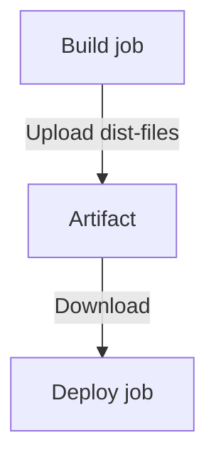

# GitHub Actions Artifacts 全指南

Artifacts（製品）是 GitHub Actions 用來 **在 jobs 之間傳遞檔案、保存測試結果、輸出 build 產物** 的主要工具。

本文件將清楚介紹：

* 什麼是 Artifact
* 為什麼需要 Artifact
* Upload / Download Artifacts 的完整語法
* 多 job pipeline 範例（含圖）
* 常見錯誤與排查方法
* 官方文件連結

---

## 📌 什麼是 Artifact？

Artifact 是 GitHub Actions workflow 執行後保存的檔案。

用途包括：

* 在 jobs 之間傳遞資料（例如：build → deploy）
* 保存測試報告（JUnit, coverage, logs）
* 保存建置產物（dist/、binary、zip...）
* Debug 用途（例如：上傳錯誤 log）

> 官方文件：[https://docs.github.com/en/actions/using-workflows/storing-workflow-data-as-artifacts](https://docs.github.com/en/actions/using-workflows/storing-workflow-data-as-artifacts)

---

## 📦 上傳 Artifact — `actions/upload-artifact`

```yaml
t- name: Upload artifacts
  uses: actions/upload-artifact@v4
  with:
    name: dist-files
    path: dist
```

### 重要參數

| 參數                  | 說明                    |
| ------------------- | --------------------- |
| `name`              | Artifact 名稱（下載時要用）    |
| `path`              | 要上傳的檔案或資料夾            |
| `if-no-files-found` | ignore / warn / error |

---

## 📥 下載 Artifact — `actions/download-artifact`

以下會將 artifact 解壓縮到指定資料夾：

```yaml
- name: Get build artifacts
  uses: actions/download-artifact@v4
  with:
    name: dist-files
    path: ./dist
```

### 常見錯誤

❌ **Artifact not found**

原因通常為：

* 名稱寫錯（必須完全相同）
* build job 沒成功 → 沒產生 artifact
* download job 未標記依賴 (`needs: build`)

---

## 🔗 多 Job Pipeline 範例（Build → Deploy）

```yaml
jobs:
  build:
    runs-on: ubuntu-latest
    steps:
      - uses: actions/checkout@v3
      - run: npm ci
      - run: npm run build
      - name: Upload build
        uses: actions/upload-artifact@v4
        with:
          name: dist-files
          path: dist

  deploy:
    runs-on: ubuntu-latest
    needs: build
    steps:
      - uses: actions/checkout@v3
      - name: Download artifact
        uses: actions/download-artifact@v4
        with:
          name: dist-files
          path: ./dist
      - run: echo "Deploying..."
```

### Pipeline 流程圖（Mermaid）



---

## 🧪 測試報告範例（只有失敗時上傳）

```yaml
- name: Run tests
  id: tests
  run: npm run test

- name: Upload report on failure
  if: failure() && steps.tests.outcome == 'failure'
  uses: actions/upload-artifact@v4
  with:
    name: test-report
    path: test.json
```

---

## ⚠️ Artifact 常見陷阱

### 1. `npm ci` 找不到 package-lock.json

代表你的 working-directory 設錯，Artifacts 沒關係，但 build 會失敗。

### 2. Upload 路徑錯誤

例如：

```
path: dist
```

如果 dist 不存在 → 不會上傳。

### 3. Download 時資料夾層級錯誤

download-artifact 會自動建立 `path` 資料夾：

```
./dist/index.html
```

如果你希望自訂子資料夾，需要額外調整。

### 4. Artifacts 不適合存大型檔案（>2GB）

建議改用：

* S3
* GH Releases
* Container registry

---

## 📚 官方文件

* Artifacts 概念：[https://docs.github.com/en/actions/using-workflows/storing-workflow-data-as-artifacts](https://docs.github.com/en/actions/using-workflows/storing-workflow-data-as-artifacts)
* upload-artifact：[https://github.com/actions/upload-artifact](https://github.com/actions/upload-artifact)
* download-artifact：[https://github.com/actions/download-artifact](https://github.com/actions/download-artifact)

